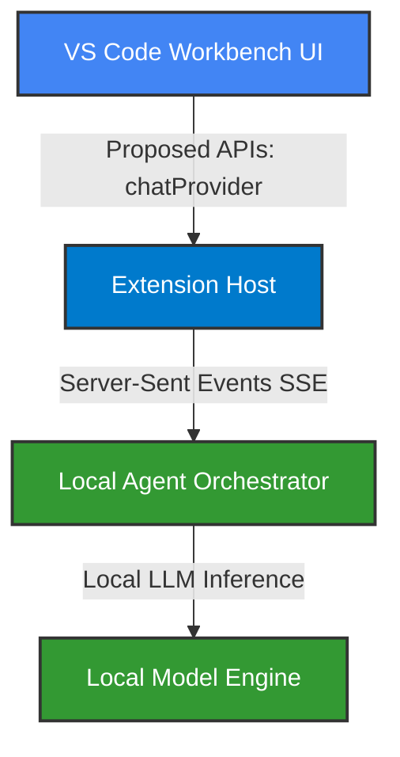

# OpenGravity 🚀
## Custom AI-Native Electron IDE (VS Code Fork)

[](https://www.typescriptlang.org/)
[](https://www.electronjs.org/)
[](https://www.chromium.org/)
[](https://nodejs.org/)

This repository hosts a custom, desktop-native distribution of Microsoft's **Code - OSS (VS Code)** integrated with **OpenGravity**—an open-source autonomous AI agent workspace. By bridging the OpenGravity local agent orchestrator with the Electron frontend editor, it enables zero-latency, context-aware developer workflows powered by local language models.

---

## 🏗️ System Architecture

The integration connects the VS Code Extension Host, Chromium frontend rendering layer, and local backend services using proposed platform APIs and streaming communication:



---

## 🛠️ Key Technical Challenges Solved

To build, bundle, and launch this custom fork, several low-level compilation, rendering, and native OS issues were identified and resolved:

| Engineering Area | Challenge / Symptom | Root Cause | Technical Resolution |
| :--- | :--- | :--- | :--- |
| **Build & Release Pipelines** | Setup script crashes and infinite shell hanging loops during dependency installations. | Upstream `preinstall` checked npm execution arguments recursively; `postinstall` crashed due to missing Git clone metadata in independent workspace builds. | Patched Node.js lifecycle scripts to prevent nested `npm exec` recursion and wrapped Git configurations in try-catch fallback blocks. |
| **Renderer Process & Shell** | Blank-screen startup crashes inside the Electron/Chromium window. | Chromium security policies blocked stylesheets imported dynamically without development flags, preventing CSS Import Maps from serving them as Blobs. | Configured workspace environment variables to force-enable VS Code's development CSS compilation service. |
| **Native OS APIs** | Native shell execution errors and terminal initialization crashes within the IDE. | The `node-pty` terminal emulator required native Windows Pseudo Console (`conpty`) binaries which were omitted in the custom build directory. | Mapped and copied the pre-compiled native Windows binaries directly to the terminal module's release folders. |
| **Extension Isolation** | Local AI providers failing to register or load in native desktop runs. | The bridging extension was configured strictly for web runtimes and clashed with other chat providers. | Restructured the extension manifest metadata to target native desktop hosts and mapped local entry-points under a isolated vendor namespace. |

---

## ⚡ Quick Start: Launching the IDE

Follow these steps to run the development environment locally:

### 1. Run the AI Orchestrator Backend
Start the local orchestrator API server (spawns on port `3777`):
```powershell
cd d:\open-antigravity-main\backend
npm run dev
```

### 2. Launch the Custom Electron IDE
Configure the development environment flags and execute the custom binary:
```powershell
# Set dev flags to enable CSS Import Maps and developer diagnostics
$env:NODE_ENV = "development"
$env:VSCODE_DEV = "1"
$env:VSCODE_CLI = "1"

# Run the compiled Code - OSS executable
& "D:\open-antigravity-main\editor\.build\electron\Code - OSS.exe" "D:\open-antigravity-main\editor"
```

### 3. Compilation & Watch Mode (Optional)
If modifying client source files, trigger compiler watches:
*   **Compile Client**: `npm run compile` (inside `/editor`)
*   **Watch Changes**: `npm run watch` (inside `/editor`)
